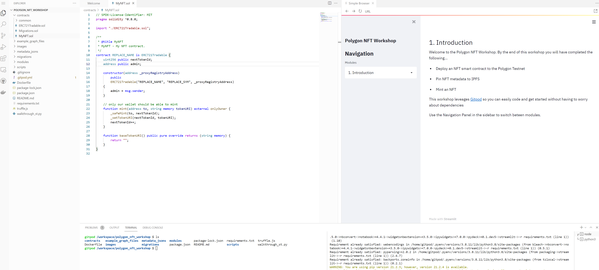

# Polygon NFT Workshop
This is an interactive workshop that guides you through the steps to deploy an NFT smart contract on the [Polygon](https://polygon.technology/) blockchain.   
By the end of this workshop, you will have completed the following

* Install a [MetaMask Wallet](https://metamask.io/)
* Deploy a smart contract to Polygon leveraging [Infura](https://infura.io/)
* Store NFT metadata on [IPFS](https://ipfs.io/) using [Pinata](https://www.pinata.cloud/)
* Mint an NFT that is listed on [OpenSea](https://opensea.io/)
* Query your NFT contract using [The Graph](https://thegraph.com/)

Slides: https://docs.google.com/presentation/d/1C7PB35izKGGu7fGFP6toIsIPd0ST3vOQtiqAncGYtKU/edit?usp=sharing

## Workshop

This workshop is powered by [Streamlit](https://streamlit.io/) and [Gitpod](https://gitpod.io/) which provides a developer environment ready to begin minting NFTs. Simply click the button below to begin building.  Follow the steps through the Streamlit application to guide you to deploying your NFT contract 

**Note:** You may have to allow a popup to open to display the Streamlit app  

> 

